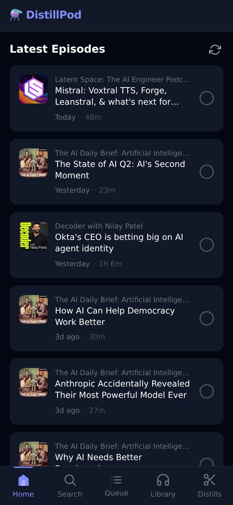
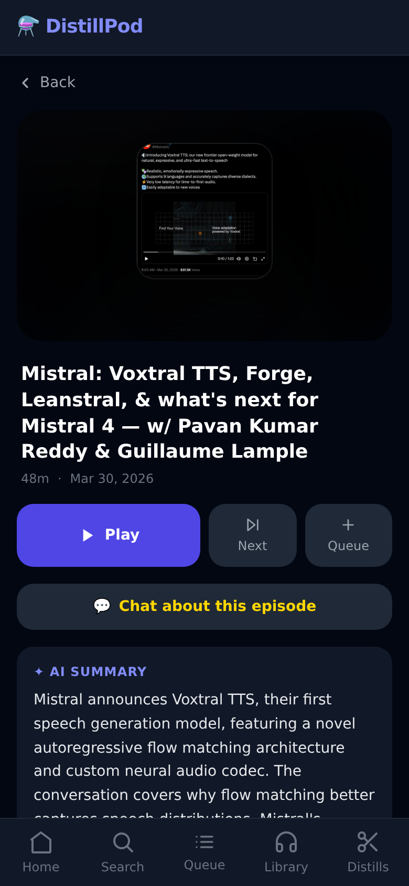
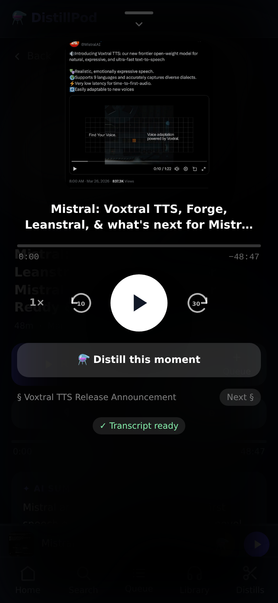
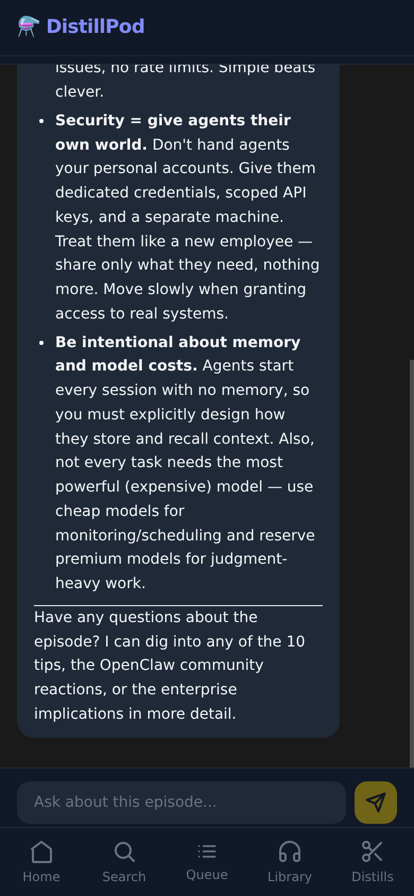
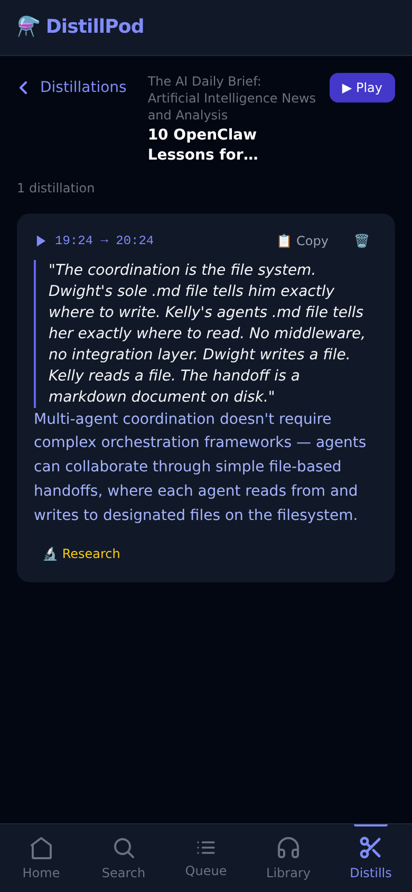
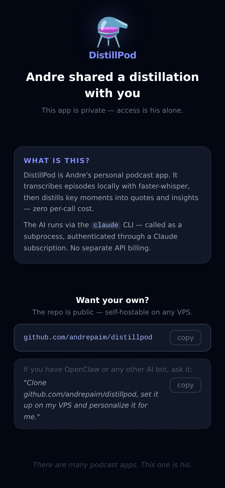

# DistillPod ⚗️

A self-hosted, mobile-first podcast app with AI-powered features: transcription, distillations, ad detection, chapter generation, episode chat, and deep research reports.

No per-call API costs. All AI runs via the Claude CLI through your existing subscription.

---

## Screenshots

<div align="center">

| Home feed | Episode | Player | Chat | Distillation | Shared link |
|:---:|:---:|:---:|:---:|:---:|:---:|
|  |  |  |  |  |  |
| Latest episodes across subscriptions | Episode detail with AI summary | Full-screen player with chapters | AI-generated insights + Q&A | Distillation card with Copy / Delete / Research | What a recipient sees when following a shared link |

</div>

---

## Why I Built This

I was paying for a premium podcast app specifically for its AI distillation feature — the ability to extract insights from what I was listening to on the fly. It worked well, but it felt wasteful: I was already running a VPS with the Claude CLI for my own OpenClaw agent, paying for a Claude subscription. Why route that through someone else's SaaS?

So I cut out the middleman.

DistillPod runs entirely on your own server. The AI features — distillations, ad detection, chapters, chat, research — all go through the Claude CLI using your existing subscription. No separate API key, no extra per-call charges on top of what you already pay, no data leaving your infrastructure to a third-party podcast app, no feature flags behind a paywall.

If you have a VPS and a Claude subscription, you already have everything you need to run this.

---

## Features

- **📰 Home feed** — unified list of the latest episodes across all subscriptions, sorted by date. Shows distillation count per episode.
- **🔍 Search** — find podcasts via the iTunes Search API (no key needed). When the search box is empty, a **🤖 Suggested for you** section surfaces daily AI-generated recommendations based on your listening history.
- **📚 Library** — browse your subscribed podcasts and their episode lists with transcript status badges.
- **▶️ Fullscreen Player** — Spotify-style slide-up player with chapter navigation, ad-free toggle, and distillation controls.
- **⚗️ Distill** — tap at any moment while listening. Captures the last 60 seconds of transcript, calls the Claude CLI, and returns a verbatim quote and a 1–2 sentence insight (~30s).
- **✂️ Ad-free audio** — after transcription, Claude classifies ad segments and ffmpeg cuts them out. Stream the clean version from the player.
- **📖 Chapters** — Claude generates 4–10 named chapters with timestamps from the full transcript. Tap any chapter to jump directly.
- **💬 Episode chat** — ask questions about any transcribed episode. Claude answers using the full transcript as context. History kept per episode (capped at 50 messages).
- **🔬 Research** — trigger a deep research report from any distillation. Claude generates queries, Tavily runs web searches, Claude synthesizes findings into an HTML report. Delivered via Telegram.
- **📋 Distillations library** — all your distillations grouped by episode. Copy, delete, or trigger research from any entry.
- **⚡ Stale-while-revalidate caching** — data is cached in localStorage with a 30-minute TTL and refreshed silently in the background.

---

## Architecture

```
┌─────────────────────────────────────────────────────────────┐
│                         User (browser)                       │
│              https://distillpod.duckdns.org                  │
└──────────────────────────┬──────────────────────────────────┘
                           │ HTTPS (Apache reverse proxy)
┌──────────────────────────▼──────────────────────────────────┐
│              FastAPI app  — port 8124 (localhost)            │
│                                                             │
│  ┌────────────────┐  ┌───────────────────────────────────┐  │
│  │  Static files  │  │           API Routers             │  │
│  │  (React SPA)   │  │  /auth  /podcasts  /player        │  │
│  │  /assets/**    │  │  /gists  /chat  /research         │  │
│  └────────────────┘  └──────────────┬────────────────────┘  │
└─────────────────────────────────────┼───────────────────────┘
                                      │
              ┌───────────────────────┼──────────────────────┐
              │                       │                       │
   ┌──────────▼──────┐   ┌───────────▼──────┐   ┌──────────▼──────┐
   │   SQLite DB      │   │   Media files     │   │  Claude CLI     │
   │ distillpod.db    │   │  /media/*.mp3     │   │ claude --print  │
   └─────────────────┘   └──────────────────┘   └────────────────┘
```

### Component breakdown

| Component | Responsibility |
|---|---|
| `frontend/` | React SPA — UI only, all state on backend |
| `backend/main.py` | FastAPI entry point, serves built frontend and reports |
| `backend/routers/auth.py` | Google OAuth2 flow, session cookie management |
| `backend/routers/podcasts.py` | Search, subscribe, episode listing, suggestions |
| `backend/routers/player.py` | Play trigger, audio streaming, transcript status, chapters |
| `backend/routers/gists.py` | Create, list, delete distillations |
| `backend/routers/chat.py` | Episode Q&A — init, message, history |
| `backend/routers/research.py` | Trigger + poll research reports |
| `backend/services/downloader.py` | Async MP3 download to `/media/` |
| `backend/services/transcriber.py` | faster-whisper, word-level timestamps, async background task |
| `backend/services/snip_engine.py` | Timestamp window lookup + Claude distillation |
| `backend/services/ad_detector.py` | Claude ad classification + ffmpeg audio surgery |
| `backend/services/chapterizer.py` | Claude chapter + summary generation |
| `backend/services/researcher.py` | Multi-turn research pipeline: Claude + Tavily → HTML report |
| `backend/services/rss.py` | RSS feed parsing |
| `backend/services/podcast_index.py` | PodcastIndex API wrapper |
| `backend/database.py` | SQLite connection, schema init, WAL mode |
| `backend/config.py` | All settings via env vars (`pydantic-settings`) |

---

## Tech Stack

**Backend**
- [FastAPI](https://fastapi.tiangolo.com/) + [uvicorn](https://www.uvicorn.org/)
- [aiosqlite](https://aiosqlite.omnilib.dev/) — async SQLite (WAL mode)
- [faster-whisper](https://github.com/SYSTRAN/faster-whisper) — local speech-to-text (CTranslate2, int8)
- [feedparser](https://feedparser.readthedocs.io/) — RSS parsing
- [httpx](https://www.python-httpx.org/) — async HTTP client
- [authlib](https://docs.authlib.org/) — Google OAuth2

**Frontend**
- [React 18](https://react.dev/) + [TypeScript](https://www.typescriptlang.org/)
- [Vite](https://vitejs.dev/) — build tool
- [Tailwind CSS v3](https://tailwindcss.com/) — styling
- [React Router v6](https://reactrouter.com/) — client-side routing
- [Zustand](https://zustand-demo.pmnd.rs/) — queue state

---

## How AI Works

All AI features call the Claude CLI as a subprocess:

```python
result = subprocess.run(
    ["claude", "--print", prompt],
    capture_output=True, text=True
)
```

The CLI authenticates through your Claude subscription — no API key, no per-call billing.

**Setup:** install the Claude CLI and log in once:

```bash
npm install -g @anthropic-ai/claude-code
claude login
```

### AI features summary

| Feature | Trigger |
|---|---|
| Distillation (quote + insight) | User taps ⚗️ while listening |
| Ad detection + audio cut | After transcription completes |
| Chapter generation + summary | Daily sync or manual script run |
| Episode chat | User opens chat or sends message |
| Deep research report | User triggers from a distillation |
| Podcast suggestions | Daily cron at 09:00 BRT |

---

## Authentication

Google OAuth2, server-side, cookie-based session (30-day HS256 JWT). Access is restricted to an email allowlist configured in `.env`.

```
GET  /auth/google           → redirect to Google consent
GET  /auth/google/callback  → exchange code → set session cookie
GET  /auth/me               → current user
POST /auth/logout           → clear cookie
```

---

## How Transcription Works

When you tap Play:

1. `POST /player/play` triggers a background download + transcription task
2. The episode MP3 is downloaded to `/media/` (streaming, skips if cached)
3. faster-whisper transcribes with `word_timestamps=True` (CPU, `medium` model by default)
4. Word-level timestamps saved to `transcripts` table
5. Ad detection runs non-fatally after transcription
6. The ⚗️ Distill button unlocks when `transcript_status = done`

### Model trade-offs

| Model | Speed (CPU) | Accuracy |
|---|---|---|
| `base` | Fastest | Good |
| `small` | Fast | Better |
| `medium` | Moderate | Very good (default) |
| `large-v3` | Slow | Best |

Set via `WHISPER_MODEL` in `.env`.

---

## Prerequisites

- Python 3.10+
- Node.js 18+
- ffmpeg (for ad-free audio generation)
- A VPS with a few GB of RAM (faster-whisper `medium` uses ~1.5GB)

---

## Installation

### 1. Clone

```bash
git clone https://github.com/andrepaim/distillpod.git
cd distillpod
```

### 2. Configure

```bash
cp .env.example .env
```

Key settings in `backend/.env`:

```env
# Google OAuth (required)
GOOGLE_CLIENT_ID=...
GOOGLE_CLIENT_SECRET=...
ALLOWED_EMAILS=you@gmail.com
SESSION_SECRET=change-me

# Optional: Podcast Index for richer metadata
PODCAST_INDEX_API_KEY=...
PODCAST_INDEX_SECRET=...

# Optional: Tavily for research reports
TAVILY_API_KEY=...

# Optional: Telegram notifications
TELEGRAM_BOT_TOKEN=...
TELEGRAM_CHAT_ID=...

# Whisper model: base | small | medium | large-v3 (default: medium)
WHISPER_MODEL=medium

# Storage (defaults work out of the box)
MEDIA_DIR=/root/distillpod/media
REPORTS_DIR=/root/distillpod/reports
PUBLIC_URL=https://your-domain.duckdns.org
```

### 3. Backend

```bash
cd backend
pip install -r requirements.txt
uvicorn main:app --host 127.0.0.1 --port 8124 --reload
```

### 4. Frontend (development)

```bash
cd frontend
npm install
npm run dev   # http://localhost:5173
```

### 5. Frontend (production build)

```bash
cd frontend
npm install
npm run build   # outputs to frontend/dist/
```

FastAPI serves `frontend/dist/` at `/` automatically.

---

## Running in Production

### systemd service

```ini
[Unit]
Description=DistillPod — AI-powered podcast player
After=network.target

[Service]
Type=simple
User=root
WorkingDirectory=/path/to/distillpod/backend
ExecStart=/usr/bin/python3 -m uvicorn main:app --host 127.0.0.1 --port 8124
Restart=always
RestartSec=5
EnvironmentFile=/path/to/distillpod/backend/.env

[Install]
WantedBy=multi-user.target
```

### Reverse proxy (Apache)

```apache
ProxyPreserveHost On
ProxyPass / http://127.0.0.1:8124/
ProxyPassReverse / http://127.0.0.1:8124/
```

---

## Scheduled Jobs

Two daily cron jobs run as background scripts:

| Job | Schedule | Script | What it does |
|---|---|---|---|
| `distillpod-daily-sync` | 03:00 BRT | `scripts/daily-sync.py` | RSS fetch → download → transcribe → ad detection → chapterization |
| `distillpod-suggest` | 09:00 BRT | `scripts/suggest-podcasts.py` | Claude generates queries → iTunes search → 4 suggestions stored |

The daily sync pipeline per subscription:
1. Reset stuck `processing` episodes
2. Fetch latest 5 RSS episodes
3. Download recent episodes (≤48h old)
4. Transcribe with faster-whisper
5. Detect + remove ads (non-fatal)
6. Generate chapters + episode summary
7. Telegram alert on errors

---

## API Reference

### Auth
| Method | Path | Description |
|---|---|---|
| `GET` | `/auth/google` | Redirect to Google OAuth |
| `GET` | `/auth/google/callback` | OAuth callback, sets session cookie |
| `GET` | `/auth/me` | Current user |
| `POST` | `/auth/logout` | Clear session |

### Podcasts
| Method | Path | Description |
|---|---|---|
| `GET` | `/podcasts/search?q=` | Search podcasts (iTunes API) |
| `GET` | `/podcasts/subscriptions` | List subscriptions |
| `POST` | `/podcasts/subscriptions/{id}` | Subscribe |
| `DELETE` | `/podcasts/subscriptions/{id}` | Unsubscribe |
| `GET` | `/podcasts/feed` | Home feed (50 episodes) |
| `GET` | `/podcasts/{id}/episodes` | Episodes for a podcast |
| `GET` | `/podcasts/suggestions` | Undismissed AI suggestions |
| `POST` | `/podcasts/suggestions/{id}/dismiss` | Dismiss a suggestion |

### Player
| Method | Path | Description |
|---|---|---|
| `POST` | `/player/play` | Trigger download + transcription |
| `GET` | `/player/episode/{id}` | Episode metadata |
| `GET` | `/player/audio/{id}` | Stream original MP3 |
| `GET` | `/player/audio-adfree/{id}` | Stream ad-free MP3 |
| `GET` | `/player/transcript-status/{id}` | Poll transcription progress |
| `GET` | `/player/adfree-status/{id}` | Check ad-free availability |
| `GET` | `/player/chapters/{id}` | Chapters + episode summary |

### Gists (Distillations)
| Method | Path | Description |
|---|---|---|
| `POST` | `/gists/` | Create distillation at current position |
| `GET` | `/gists/?episode_id=` | List distillations |
| `DELETE` | `/gists/{id}` | Delete distillation |

### Chat
| Method | Path | Description |
|---|---|---|
| `GET` | `/chat/{episode_id}` | Conversation history |
| `POST` | `/chat/{episode_id}/init` | Initialize chat (AI summary + invitation) |
| `POST` | `/chat/{episode_id}/message` | Send message, get reply |

### Research
| Method | Path | Description |
|---|---|---|
| `POST` | `/research/{gist_id}` | Trigger research report |
| `GET` | `/research/{gist_id}` | Poll status + report URL |

---

## Storage

| Path | Contents |
|---|---|
| `distillpod.db` | SQLite — subscriptions, episodes, transcripts, gists, chats, chapters, suggestions, research |
| `media/` | Downloaded episode MP3s (named by MD5 of episode ID) |
| `media/*_adfree.mp3` | Ad-free cuts generated by ffmpeg |
| `reports/` | HTML research reports |

---

## Testing

### Backend (pytest)

```bash
cd /root/distillpod
python3 -m pytest tests/ -v
```

Tests run against an in-memory SQLite DB. Auth bypassed via test session cookie.

### E2E (Playwright)

```bash
cd frontend
npx playwright test
```

Mobile viewport (390×844), Chromium. Requires `TEST_MODE=true` in `.env` for auth bypass.

Test files: navigation, home feed, search, library, player (fullscreen, gists, chapters, ad-free, chat), gists library, caching, SPA routing.

---

## License

MIT
